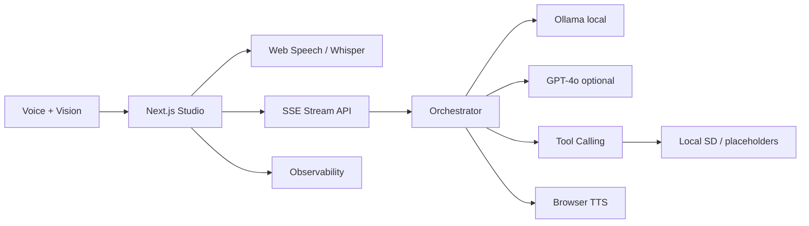

# Iris

[](https://github.com/jahidbappi/iris/actions)
[](https://iris-puce.vercel.app)

**Real-time multimodal voice + vision AI studio.**

**Live demo:** https://iris-puce.vercel.app · **Studio:** https://iris-puce.vercel.app/studio

Iris lets you speak naturally to an AI creative director that sees through your camera, generates and edits visuals in real time, and narrates results back with voice — with production-grade streaming, cost guardrails, and observability.

## Impact

- **Multimodal pipeline** — voice → LLM tool calling → image gen → TTS in one SSE stream
- **Demo mode on Vercel** — full studio UX with zero API keys; reviewers can try instantly
- **Local OSS mode** — Ollama + Web Speech + browser TTS at **$0** when you clone locally
- **Observability dashboard** — per-session cost estimates, P50/P95 latency, stage breakdown
- **Shareable replays** — session snapshots with timeline playback

## Free stack ($0)

| Mode | Setup | LLM | ASR | TTS |
|------|-------|-----|-----|-----|
| **Demo** | Open Vercel URL | Mock | Web Speech / mock | Browser |
| **Local OSS** | `ollama pull llama3.2 && npm run dev` | Ollama | Web Speech API | Browser |
| **Cloud** | Optional API keys | GPT-4o | Whisper | OpenAI TTS |

```bash
# Full live experience at $0 — industry-standard OSS models
ollama pull llama3.1:8b
ollama pull llava
cd iris && npm install && npm run dev
# Studio shows "Local OSS" badge when Ollama is detected
```

See **[OSS.md](./OSS.md)** for ASR/TTS/image-gen alternatives (faster-whisper, Piper, local Stable Diffusion).

## Architecture



## Features

- Push-to-talk (Web Speech API in free modes) and text input
- Camera, screen share, and image upload vision input
- Tool-calling LLM via Ollama or OpenAI
- SSE streaming pipeline with visible thinking states
- Session replays with shareable links
- Runtime badges: Demo Mode · Local OSS · Cloud

## Quick Start

```bash
npm install
npm run dev
# → http://localhost:3000
```

Optional cloud keys: `cp .env.example .env.local`

## Environment

| Variable | Required | Description |
|----------|----------|-------------|
| `OLLAMA_BASE_URL` | No | Default `http://127.0.0.1:11434` |
| `OLLAMA_MODEL` | No | Default `llama3.2` |
| `OPENAI_API_KEY` | No | Enables cloud GPT-4o, Whisper, TTS, DALL-E |
| `REPLICATE_API_TOKEN` | No | Enables cloud SDXL |

**Hero path needs no keys.** Demo mode on Vercel; Local OSS when Ollama runs alongside `npm run dev`.

## Deploy

```bash
vercel deploy   # Demo mode — no env vars required
```

## Project Structure

```
src/
├── app/              # Pages + API routes
├── components/       # Studio UI
├── lib/ai/           # Ollama, orchestrator, mock, providers
├── lib/observability/
└── lib/store/        # Session state
OSS.md                # Free/local stack guide
DEMO.md               # Portfolio video script
```

## License

MIT
