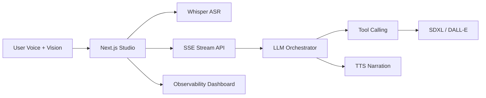

# Iris

[](https://github.com/jahidbappi/iris/actions)
[](https://iris-puce.vercel.app)

**Real-time multimodal voice + vision AI studio.**

**Live website:** https://iris-puce.vercel.app · **Studio:** https://iris-puce.vercel.app/studio

Iris lets you speak naturally to an AI creative director that sees through your camera, generates and edits visuals in real time, and narrates results back with voice — with production-grade streaming, cost guardrails, and observability.

## Architecture



## Features

- Push-to-talk and text input with streaming transcription
- Camera, screen share, and image upload vision input
- Tool-calling LLM for generate / edit / describe decisions
- SSE streaming pipeline with visible thinking states
- Session replays with shareable links
- Cost, latency, and token observability dashboard
- Demo mode (no API keys required)

## Quick Start

```bash
cp .env.example .env.local   # optional API keys
npm install
npm run dev
```

**Live demo:** [https://iris-puce.vercel.app](https://iris-puce.vercel.app)

## Environment

| Variable | Required | Description |
|----------|----------|-------------|
| `OPENAI_API_KEY` | No | Enables GPT-4o, Whisper, TTS, DALL-E |
| `REPLICATE_API_TOKEN` | No | Enables SDXL image generation |
| `OPENAI_MODEL` | No | Default `gpt-4o` |

Without keys, Iris runs in **demo mode** with mock responses and browser TTS.

## Deploy

```bash
# Vercel
vercel deploy
```

GPU worker (optional): deploy `worker/` to Modal or Fly.io for dedicated image jobs.

## Project Structure

```
src/
├── app/              # Pages + API routes
├── components/       # Studio UI
├── lib/ai/           # Orchestrator, tools, providers
├── lib/observability/
└── lib/store/        # Session state
worker/               # FastAPI GPU worker skeleton
```

## License

MIT
